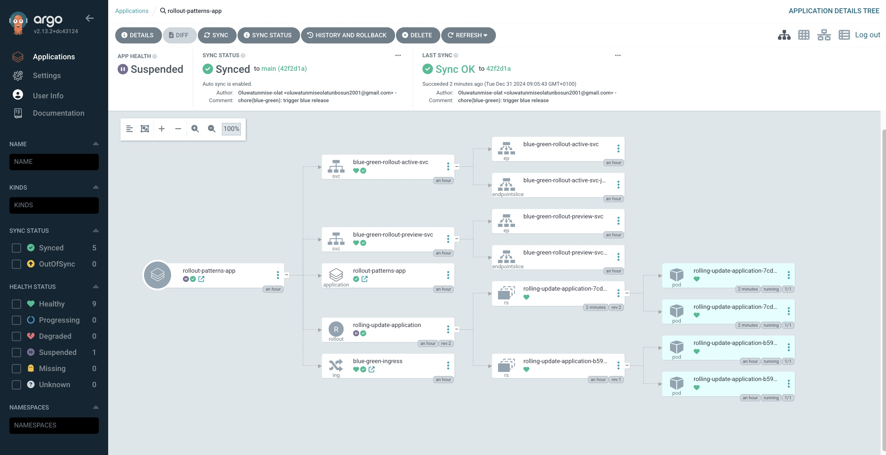
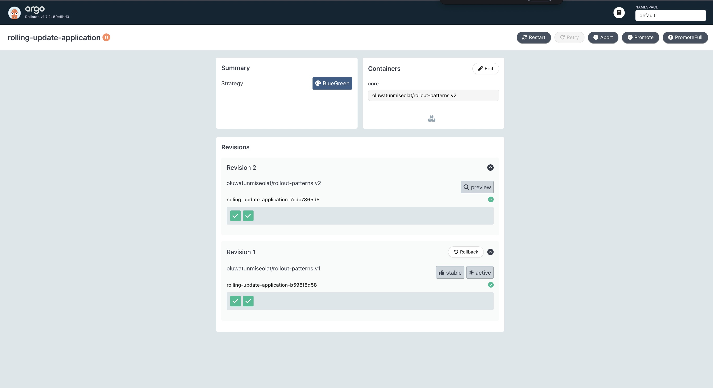
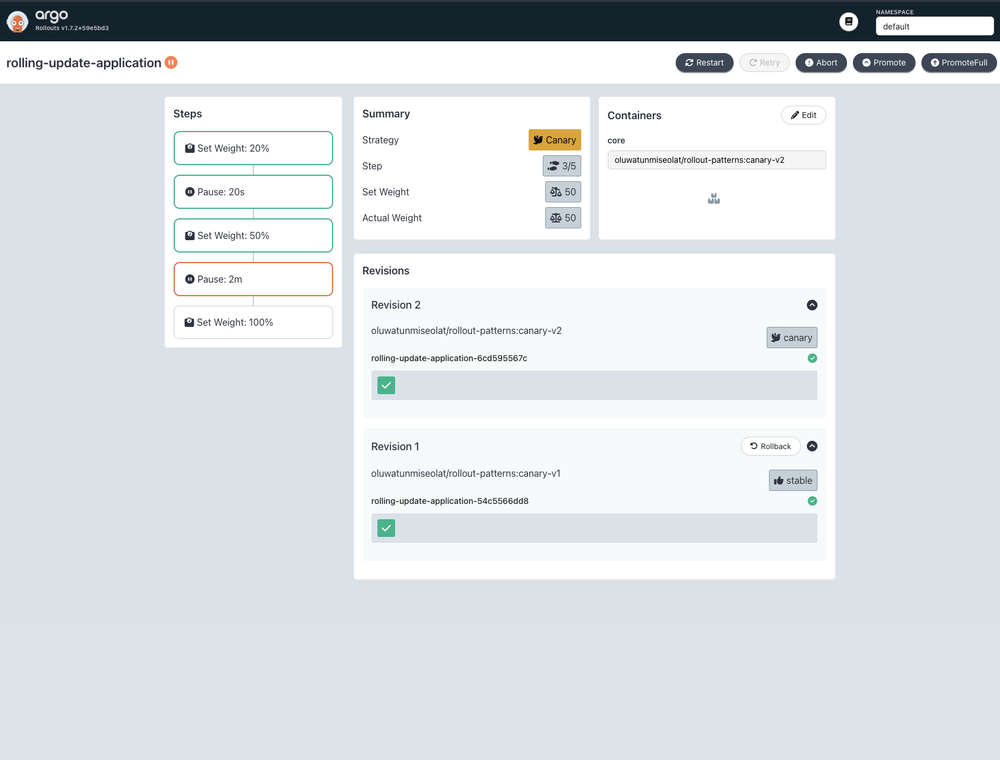

# Deployment Rollout Patterns: Leveraging ArgoCD For Managing Application Rollouts

This repository demonstrates progressive delivery strategies using Argo CD and Argo Rollouts. It includes implementations of both Blue-Green and Canary deployment patterns.

## Architecture Overview

- **Blue-Green Deployment**: Maintains two identical environments with different versions. Traffic switches completely from blue to green after verification.
- **Canary Deployment**: Gradually shifts traffic from the old version to the new version, allowing for controlled testing and monitoring.

## Deployment Dashboards

### Blue-Green Deployment


_ArgoCD dashboard showing Blue-Green deployment status_


_Argo Rollouts dashboard displaying Blue-Green deployment progress_

### Canary Deployment


_Argo Rollouts dashboard showing Canary deployment progress_

## Prerequisites

- kubectl installed
- Argo CD CLI installed
- Access to a Kubernetes cluster

## Setup Instructions

### 1. Install Argo CD

```bash
kubectl create namespace argocd
kubectl apply -n argocd -f https://raw.githubusercontent.com/argoproj/argo-cd/stable/manifests/install.yaml
kubectl config set-context --current --namespace=argocd
argocd login --core
kubectl patch svc argocd-server -n argocd -p '{"spec": {"type": "LoadBalancer"}}'
```

### 2. Configure Cluster Access

```bash
kubectl create -f manifests/argocd/project.yaml
```

### 3. Install Argo Rollouts

```bash
kubectl create namespace argo-rollouts
kubectl apply -n argo-rollouts -f https://github.com/argoproj/argo-rollouts/releases/latest/download/install.yaml
```

## Deployment Patterns

### Blue-Green Deployment

Located in `/infrastructure/k8s-manifests/blue-green/`

Key components:

- Active service routing production traffic
- Preview service for testing new version
- Rollout configuration managing the deployment strategy
- Ingress rules for traffic routing

To promote a deployment:

```bash
kubectl argo rollouts promote blue-green-application
```

### Canary Deployment

Located in `/infrastructure/k8s-manifests/canary/`

Key components:

- Main service handling traffic distribution
- Rollout configuration with progressive traffic shifting
- Ingress configuration for routing

Strategy:

- Initial deployment: 20% traffic
- Pause for 20s
- Increase to 50% traffic
- Pause for 2m
- Complete rollout: 100% traffic

All manifest files can be found in their respective directories under `/infrastructure/k8s-manifests/`.
